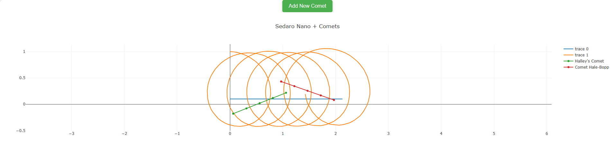

# My Contribution:

We were talking about how one of the next steps for Sedaro was to integrate 3rd part modeling software with Sedaro. I decided to base my contribution off of this, and add functionality to communicate with "3rd party simulation software" of comets. 

# Functionality
I added a second Docker container that contained an API built with python and Flask. The webpage contains a button, that when pressed, sends an API request to the API requesting comet data. This API could then act as the middleman between the webpage and the 3rd party software. Since I did not have an actual 3rd party to get data from, I instead generated some random comet data. Once this data was recieved from the "3rd party", important data processing could be done on this API container, distributing the computing load away from the container with the web app. Finally, the API container sent back the processed data to the webpage to add to the Plot.

# Instructions for use:
Once Docker Desktop is opened, I included a bash script `script.sh` that runs all of the needed commands which can be run with ./script.sh (may need to be given permission with **chmod +x my_script.sh** using WSL/macOS Terminal). Alternatively, you can run the following commands:
1. docker build -t sedaro-nano .
2. docker build -t api-image -f APIDockerfile . 
3. docker network create myNetwork
4. docker run -d --name api-container --network myNetwork -p 5000:5000 api-image
5. docker run -d --name web-container --network myNetwork -p 8080:3000 sedaro-nano

Then, the webpage will be available at http://localhost:8080/. It may take a few moments for the container to fully come up and serve the page.